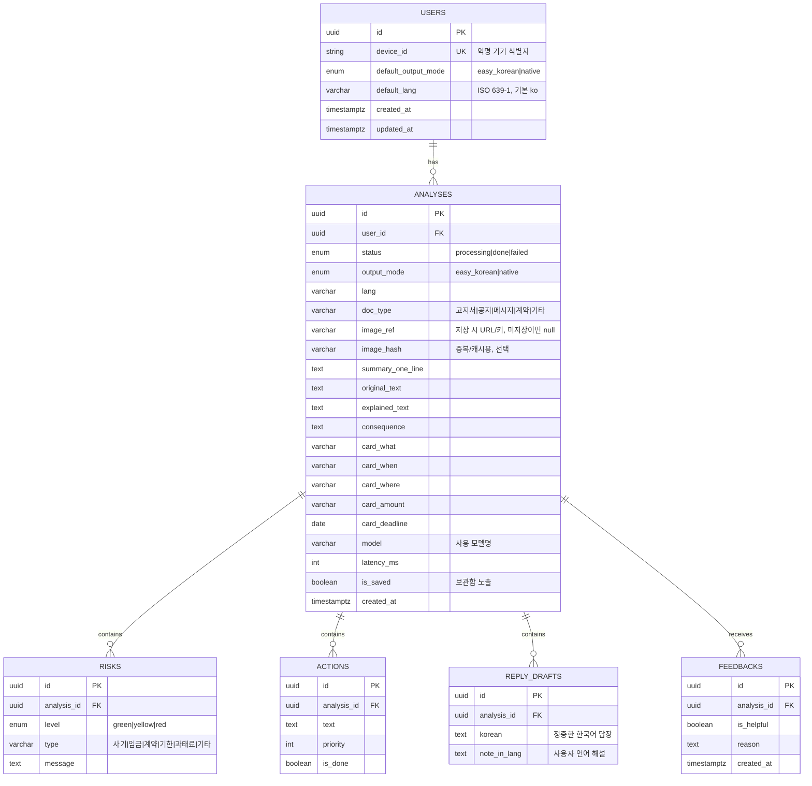

# 읽고 (Ilgo) — 백엔드 API 명세 & ERD

| 항목 | 내용 |
|---|---|
| 문서 버전 | v1.1 |
| 작성일 | 2026-06-30 |
| 대상 | 백엔드 개발자 |
| 기반 | `읽고_PRD.md`, `읽고_기능명세서.md` |
| API 스타일 | REST / JSON |
| 기술 스택 | **Spring Boot** · **Supabase(PostgreSQL)** · **Railway** · **Swagger UI**(springdoc) |
| 인증(MVP) | 익명 기기 식별 헤더 `X-Device-Id` (로그인 없음) |

---

## 1. 왜 백엔드가 필요한가 (아키텍처)

기존 앱-only 설계는 Flutter가 Claude를 직접 호출했다. 백엔드가 생기면서 다음을 서버로 옮긴다.

- **API 키 은닉:** Claude API 키를 앱에 넣지 않고 서버에 둔다(보안).
- **분석 저장/보관함:** 결과를 DB에 저장해 다시 열람.
- **일관성·재사용·모니터링:** 프롬프트/모델을 서버에서 관리, 로깅.

```
┌────────────┐  1. 이미지+모드/언어   ┌─────────────────┐  2. 멀티모달 호출  ┌──────────────┐
│  Flutter   │ ────────────────────▶ │   읽고 백엔드     │ ─────────────────▶ │  Anthropic   │
│    앱      │ ◀──────────────────── │  (API Gateway/   │ ◀───────────────── │  Messages API│
└────────────┘  4. 구조화 결과(JSON)  │   Service + DB)  │  3. JSON 응답      └──────────────┘
                                      └────────┬─────────┘
                                               │ 저장/조회
                                          ┌────▼─────┐
                                          │ Supabase │  users · analyses · risks · actions · reply_drafts  (PostgreSQL)
                                          └──────────┘
```

> 백엔드 = **Spring Boot**(Railway 배포), DB = **Supabase(PostgreSQL)**, 이미지 저장(선택) = Supabase Storage. AI 호출은 서버에서.

**핵심 책임:** 백엔드는 `POST /v1/analyses`에서 이미지를 받아 **서버측에서 Claude를 1회 호출**하고, 결과를 파싱·저장해 앱에 돌려준다(§6).

## 1.1 기술 스택

| 레이어 | 기술 |
|---|---|
| 언어/프레임워크 | **Spring Boot 3.x** (Java 17+ 또는 Kotlin), Spring Web(REST) |
| 데이터 접근 | Spring Data JPA + Hibernate, HikariCP |
| DB | **Supabase (PostgreSQL)** — 관리형 Postgres, JDBC 연결 |
| 이미지 저장(선택) | Supabase Storage(비공개 버킷) → `image_ref` |
| AI 호출 | Spring `RestClient`/`WebClient` → Anthropic Messages API |
| API 문서 | **springdoc-openapi** → **Swagger UI** |
| 스키마 관리(선택) | Flyway 또는 Supabase SQL 마이그레이션 |
| 배포 | **Railway** (Nixpacks 자동 빌드 또는 Dockerfile, 환경변수 주입) |
| 빌드 | Gradle 또는 Maven |

**주요 의존성 (Gradle 예)**
```gradle
implementation 'org.springframework.boot:spring-boot-starter-web'
implementation 'org.springframework.boot:spring-boot-starter-data-jpa'
implementation 'org.springframework.boot:spring-boot-starter-validation'
implementation 'org.springdoc:springdoc-openapi-starter-webmvc-ui:2.6.0'
runtimeOnly    'org.postgresql:postgresql'
// 선택: implementation 'org.flywaydb:flyway-core'
```

---

## 2. 공통 규약

- **Base URL:** `https://ilgo-api.up.railway.app/v1` *(Railway 배포 도메인, placeholder)*
- **인증:** 모든 요청 헤더 `X-Device-Id: <uuid>` (앱이 최초 실행 시 생성·저장하는 익명 기기 ID). 서버는 이 값으로 `users`를 upsert. *(향후 `Authorization: Bearer` 확장 여지)*
- **Content-Type:** `application/json` (이미지: base64 필드). 대안으로 `multipart/form-data` 허용(§5.1).
- **시간 형식:** ISO 8601 UTC (`2026-06-30T07:10:00Z`).
- **ID:** UUID v4 문자열.
- **페이지네이션:** 커서 기반 — `?limit=20&cursor=<opaque>`. 응답에 `next_cursor`(없으면 null).
- **에러 포맷(공통):**
```jsonc
{
  "error": {
    "code": "INVALID_IMAGE",          // 기계 판별용 코드
    "message": "이미지를 읽을 수 없습니다.", // 사람용 메시지
    "details": { "field": "image_base64" } // 선택
  }
}
```
- **주요 상태코드:** 200 OK · 201 Created · 204 No Content · 400 Bad Request · 401 Unauthorized(디바이스 헤더 없음) · 404 Not Found · 413 Payload Too Large · 422 Unprocessable(AI 파싱 실패) · 429 Too Many Requests · 502 Bad Gateway(Claude 오류) · 500.

---

## 3. 데이터 모델 (ERD)



### 3.1 테이블 상세

**users** — 익명 기기 단위 사용자
| 컬럼 | 타입 | 제약 | 설명 |
|---|---|---|---|
| id | uuid | PK | |
| device_id | varchar(64) | UNIQUE, NOT NULL | 앱이 생성한 익명 ID |
| default_output_mode | enum | NOT NULL, default `easy_korean` | 출력 모드 |
| default_lang | varchar(8) | NOT NULL, default `ko` | ISO 639-1 |
| created_at / updated_at | timestamptz | NOT NULL | |

**analyses** — 분석 1건(= 보관함 1항목)
| 컬럼 | 타입 | 제약 | 설명 |
|---|---|---|---|
| id | uuid | PK | |
| user_id | uuid | FK→users.id, NOT NULL, ON DELETE CASCADE | |
| status | enum | NOT NULL | processing/done/failed |
| output_mode | enum | NOT NULL | easy_korean/native |
| lang | varchar(8) | NOT NULL | 요청 시 언어 |
| doc_type | varchar(16) | NULL | 문서 종류 |
| image_ref | varchar(512) | NULL | 저장 시 URL/키. **미저장 정책이면 null** |
| image_hash | varchar(64) | NULL | sha256, 캐시/중복 |
| summary_one_line | text | NULL | 핵심 한 문장 |
| original_text | text | NULL | 원문(OCR) |
| explained_text | text | NULL | 쉬운말/모국어 풀이 |
| consequence | text | NULL | 안 하면 생기는 일 |
| card_what/when/where/amount | varchar(255) | NULL | 핵심 카드(1:1이라 컬럼) |
| card_deadline | date | NULL | 기한 |
| model | varchar(48) | NULL | 예: claude-opus-4-8 |
| latency_ms | int | NULL | 호출 소요 |
| is_saved | boolean | NOT NULL, default true | 보관함 |
| created_at | timestamptz | NOT NULL | |

**risks / actions / reply_drafts / feedbacks** — analyses에 1:N (ON DELETE CASCADE)
- **risks**: level(enum), type(varchar16), message(text)
- **actions**: text(text), priority(int), is_done(boolean default false)
- **reply_drafts**: korean(text), note_in_lang(text) — *native 모드에서만 생성*
- **feedbacks**: is_helpful(boolean), reason(text null), created_at — *정확도 피드백(선택)*

### 3.2 인덱스
- `users(device_id)` UNIQUE
- `analyses(user_id, created_at DESC)` — 보관함 목록
- `analyses(image_hash)` — 캐시 조회(선택)
- `risks(analysis_id)`, `actions(analysis_id)`, `reply_drafts(analysis_id)`, `feedbacks(analysis_id)`

### 3.3 설계 노트
- **카드는 1:1이라 컬럼**으로(테이블 분리 불필요). risks/actions/reply_drafts는 개수가 가변이라 **1:N 테이블**.
- **개인정보:** 기본은 `image_ref = null`(이미지 미저장, 텍스트 결과만 보관). 저장 정책은 §7 참고.
- **보관함 = analyses 조회**(별도 테이블 불필요). 숨김은 `is_saved=false`.
- **DB = Supabase(PostgreSQL).** uuid는 `gen_random_uuid()` 기본값, `timestamptz` 사용. enum은 **varchar + CHECK 제약**(JPA `@Enumerated(EnumType.STRING)`과 궁합) 또는 PG 네이티브 enum. 자식 테이블 FK는 `ON DELETE CASCADE`. Spring이 서비스 계정으로 접근하므로 **RLS는 MVP에서 서버 전용(off)** 로 둔다.

---

## 4. 엔드포인트 요약

| Method | Path | 설명 | 우선순위 |
|---|---|---|---|
| POST | `/v1/analyses` | 이미지 분석(핵심, Claude 프록시) | MVP |
| GET | `/v1/analyses/{id}` | 분석 단건 조회 | MVP |
| GET | `/v1/analyses` | 보관함 목록(페이지네이션) | MVP |
| DELETE | `/v1/analyses/{id}` | 분석 삭제 | P1 |
| PATCH | `/v1/analyses/{id}/actions/{action_id}` | 할 일 완료 토글 | P2 |
| POST | `/v1/analyses/{id}/replies:regenerate` | 답장 재생성(native) | P2 |
| POST | `/v1/analyses/{id}/feedback` | 정확도 피드백 | P2 |
| GET/PUT | `/v1/profile` | 기본 모드/언어 조회·저장 | P1 |
| GET | `/health` | 헬스체크 | MVP |

---

## 5. 엔드포인트 상세

### 5.1 POST /v1/analyses — 이미지 분석 (★핵심)
어려운 글 이미지를 받아 **서버가 Claude를 1회 호출**하고, 구조화 결과를 저장·반환.

- **인증:** `X-Device-Id` 필수
- **요청 (application/json):**
```jsonc
{
  "image_base64": "<BASE64>",         // 필수
  "media_type": "image/jpeg",          // image/jpeg | image/png
  "output_mode": "easy_korean",        // easy_korean | native
  "lang": "ko",                        // native면 en 등
  "save": true                         // 선택, 기본 true(보관함 저장)
}
```
  - **대안(multipart/form-data):** `image`(file), `output_mode`, `lang`, `save`.
- **처리:** 검증 → (선택)이미지 저장 → Claude 호출(§6) → JSON 파싱 → `analyses`(+risks/actions/reply_drafts) 저장 → 결과 반환.
- **응답 201:**
```jsonc
{
  "id": "5b1e...uuid",
  "status": "done",
  "output_mode": "easy_korean",
  "lang": "ko",
  "doc_type": "고지서",
  "summary_one_line": "8월 15일까지 건강보험료 6만 8천 원을 내야 해요",
  "original_text": "…원문…",
  "explained_text": "…쉬운 한국어 풀이…",
  "consequence": "기한이 지나면 연체료가 더해질 수 있어요",
  "cards": { "what": "건강보험료 납부", "when": null, "where": null, "amount": "68,000원", "deadline": "2026-08-15" },
  "risks": [
    { "id": "r1", "level": "yellow", "type": "기한", "message": "8월 15일이 지나면 연체료가 붙을 수 있어요" }
  ],
  "actions": [
    { "id": "a1", "text": "은행 앱이나 지로로 6만 8천 원을 내세요", "priority": 1, "is_done": false }
  ],
  "reply_drafts": [],                  // native 모드일 때만 채워짐
  "created_at": "2026-06-30T07:10:00Z"
}
```
- **에러:** `400 INVALID_REQUEST`(필드 누락) · `400 UNSUPPORTED_MEDIA_TYPE` · `413 IMAGE_TOO_LARGE`(>5MB) · `422 AI_PARSE_FAILED`(Claude 응답 파싱 실패, 재시도 후에도) · `429 RATE_LIMITED` · `502 UPSTREAM_ERROR`(Claude 오류/타임아웃).
- **비고:** 서버는 파싱 실패 시 **1회 재시도**(§6). 그래도 실패면 422 + 가능하면 `explained_text`만 담은 부분 결과.

### 5.2 GET /v1/analyses/{id} — 단건 조회
- **인증:** `X-Device-Id`(소유자만)
- **응답 200:** 5.1과 동일 구조.
- **에러:** `404 NOT_FOUND` · `403 FORBIDDEN`(다른 기기 소유).

### 5.3 GET /v1/analyses — 보관함 목록
- **쿼리:** `?limit=20&cursor=<opaque>&saved=true`
- **응답 200:**
```jsonc
{
  "items": [
    { "id": "5b1e...", "doc_type": "고지서", "summary_one_line": "8월 15일까지 6만 8천 원…",
      "top_risk_level": "yellow", "card_deadline": "2026-08-15", "created_at": "2026-06-30T07:10:00Z" }
  ],
  "next_cursor": null
}
```
  - 목록은 **요약 필드만**(상세는 5.2). `top_risk_level`은 최고 위험 레벨.

### 5.4 DELETE /v1/analyses/{id}
- **응답 204** (본문 없음). CASCADE로 하위 risks/actions/reply_drafts 삭제.
- **에러:** `404` · `403`.

### 5.5 PATCH /v1/analyses/{id}/actions/{action_id} — 할 일 토글
- **요청:** `{ "is_done": true }`
- **응답 200:** `{ "id": "a1", "is_done": true }`

### 5.6 POST /v1/analyses/{id}/replies:regenerate — 답장 재생성 (native)
- **요청(선택):** `{ "tone": "polite" }`
- **처리:** 저장된 원문/풀이 기반으로 Claude 재호출해 `reply_drafts` 갱신.
- **응답 200:** `{ "reply_drafts": [ { "id":"rd1", "korean":"…", "note_in_lang":"…" } ] }`
- **에러:** `409 NOT_NATIVE_MODE`(easy_korean 분석엔 답장 없음).

### 5.7 POST /v1/analyses/{id}/feedback — 정확도 피드백
- **요청:** `{ "is_helpful": false, "reason": "금액이 틀림" }`
- **응답 201:** `{ "id": "f1" }`

### 5.8 GET / PUT /v1/profile — 기본 모드/언어
- **GET 200:** `{ "output_mode": "easy_korean", "lang": "ko" }`
- **PUT 요청:** `{ "output_mode": "native", "lang": "en" }` → **200** 저장값 반환.
- **비고:** 앱 로컬 저장만으로도 동작 가능. 서버 저장은 기기 교체·복원용(선택).

### 5.9 GET /health
- **응답 200:** `{ "status": "ok", "time": "2026-06-30T07:10:00Z" }`

---

## 6. Claude 연동 (백엔드 서버측 구현)

`POST /v1/analyses` 내부에서 서버가 수행. **키는 Railway 환경변수 `ANTHROPIC_API_KEY`**. Spring은 `RestClient`(또는 `WebClient`)로 호출.

- **호출:** `POST https://api.anthropic.com/v1/messages`
  - Headers: `x-api-key: $ANTHROPIC_API_KEY`, `anthropic-version: 2023-06-01`, `content-type: application/json`
  - Body: `model`(claude-opus-4-8 / sonnet-4-6), `max_tokens` 1200, `temperature` 0.2, `system`(아래), `messages`=[{user: [image block(base64), text: "user_profile={output_mode,lang}. JSON으로만."]}, {assistant: "{"}]  ← prefill로 JSON 강제
- **시스템 프롬프트(요지):** "한국어 글을 못 읽는 사람을 돕는 도우미. output_mode가 easy_korean이면 쉬운 한국어, native면 lang으로 의역. 키(doc_type, summary_one_line, original_text, explained_text, cards{what,when,where,amount,deadline}, risks[{level,type,message}], actions[{text,priority}], consequence, reply_drafts[{korean,note_in_lang}](native만))의 JSON으로만. 위험은 스미싱·임금차감·부당공제·과태료·신고기한; 확신 없으면 yellow. 금액·날짜는 정확 인용, 불확실하면 null, 없는 사실 금지."
- **파싱:** 응답 텍스트 → JSON 파싱 → 필드를 DB 컬럼/자식 테이블에 매핑.
- **신뢰성:**
  - 타임아웃 30s. 실패/JSON 깨짐 → **재시도 1회**.
  - 재시도도 실패 → `status=failed` 저장 + `422 AI_PARSE_FAILED`.
  - 레이트리밋(429) → 지수 백오프 1회 후 502.
- **주의:** `card_deadline`은 `YYYY-MM-DD`만 저장(파싱 실패 시 null).

---

## 7. 비기능 / 보안

| 항목 | 규칙 |
|---|---|
| 이미지 크기 | ≤ 5MB, `image/jpeg`·`image/png`만. 초과 시 413. (앱이 1280px 다운스케일 권장) |
| API 키 | Claude 키·Supabase 서비스 키는 **Railway 환경변수**(서버 전용). 앱/깃/로그에 노출 금지. |
| 개인정보 | 기본 **이미지 미저장**(`image_ref=null`), 텍스트 결과만 보관. 저장 시 **Supabase Storage 비공개 버킷** + 만료(TTL) 권장. |
| 인증 | MVP는 `X-Device-Id`(익명). 소유자 검증(다른 기기의 analysis 접근 403). |
| Rate limit | 기기당 분당 N회 제한(예: 20/min) → 429. |
| CORS | 앱은 네이티브라 불필요, 관리자 웹 붙일 경우만 허용 도메인 지정. |
| 로깅 | 요청/지연/모델/실패 로깅. 단, 원문·개인정보 로그 최소화. |
| 응답 목표 | 분석 API p95 ≤ 8초(이미지 다운스케일 전제). |

---

## 8. 부록 — Enum 정리

| Enum | 값 |
|---|---|
| output_mode | `easy_korean`, `native` |
| lang | ISO 639-1 (`ko`, `en`, `km`, `vi`, `ne` …) — 데모 `ko`/`en` |
| doc_type | `고지서`, `공지`, `메시지`, `계약`, `기타` |
| status | `processing`, `done`, `failed` |
| risk.level | `green`, `yellow`, `red` |
| risk.type | `사기`, `임금`, `계약`, `기한`, `과태료`, `기타` |

---

## 9. 에러 코드 요약

| HTTP | code | 상황 |
|---|---|---|
| 400 | INVALID_REQUEST | 필수 필드 누락/형식 오류 |
| 400 | UNSUPPORTED_MEDIA_TYPE | jpeg/png 외 |
| 401 | MISSING_DEVICE_ID | `X-Device-Id` 없음 |
| 403 | FORBIDDEN | 다른 기기의 리소스 접근 |
| 404 | NOT_FOUND | 리소스 없음 |
| 409 | NOT_NATIVE_MODE | 답장 재생성을 easy 분석에 요청 |
| 413 | IMAGE_TOO_LARGE | 이미지 > 5MB |
| 422 | AI_PARSE_FAILED | Claude 응답 파싱 실패(재시도 후) |
| 429 | RATE_LIMITED | 호출 한도 초과 |
| 502 | UPSTREAM_ERROR | Claude 오류/타임아웃 |
| 500 | INTERNAL_ERROR | 서버 오류 |

## 10. 배포 (Railway) & 환경변수

- **배포 방식:** GitHub 저장소를 Railway에 연결 → **Nixpacks**가 Gradle/Maven 자동 빌드(또는 `Dockerfile`).
- **포트:** `application.yml`에 `server.port=${PORT:8080}` (Railway가 `PORT` 주입).
- **헬스체크:** Railway Health Check Path = `/health` (또는 actuator `/actuator/health`).
- **DB 연결(Supabase):** Supabase 대시보드 → Project Settings → Database의 connection string 사용.
  - 직접 연결(포트 5432)이 JPA엔 단순. **Pooler(6543, pgbouncer transaction mode)** 쓰면 prepared statement 이슈 → `?prepareThreshold=0` 또는 Hikari 설정 필요. Supabase 프로젝트의 **IPv4/IPv6** 지원 여부 확인.
- **JPA 스키마:** 초기 `spring.jpa.hibernate.ddl-auto=update`(또는 Flyway로 관리), 운영 `validate`.

**환경변수**
| 변수 | 설명 |
|---|---|
| `ANTHROPIC_API_KEY` | Claude API 키 (필수) |
| `ANTHROPIC_MODEL` | 기본 `claude-opus-4-8`, 속도용 `claude-sonnet-4-6` |
| `SPRING_DATASOURCE_URL` | `jdbc:postgresql://<supabase-host>:5432/postgres` |
| `SPRING_DATASOURCE_USERNAME` | Supabase DB 유저(예: `postgres`) |
| `SPRING_DATASOURCE_PASSWORD` | Supabase DB 비밀번호 |
| `SUPABASE_URL` / `SUPABASE_SERVICE_ROLE_KEY` | 이미지 Storage 사용 시 |
| `RATE_LIMIT_PER_MIN` | 기기당 분당 호출 제한(예: 20) |
| `PORT` | Railway 자동 주입 |

## 11. API 문서 (Swagger UI)

- **의존성:** `org.springdoc:springdoc-openapi-starter-webmvc-ui:2.6.x`
- **접속 URL:**
  - 로컬: `http://localhost:8080/swagger-ui.html`
  - 배포: `https://<railway-domain>/swagger-ui.html`
  - OpenAPI 스펙(JSON): `/v3/api-docs`
- **문서화:** 컨트롤러에 `@Operation(summary=…)`, DTO에 `@Schema(description=…)`, 파라미터에 `@Parameter`. 서버 URL·설명은 `OpenAPI` 빈으로 설정.
- **팁:** `springdoc.swagger-ui.path`로 경로 커스터마이즈 가능. **해커톤 데모는 공개** 두고, 운영 전환 시 접근 제어 검토. 프론트(Flutter) 개발자와 계약 맞출 때 Swagger UI가 곧 살아있는 문서 역할.

---

*백엔드 API 명세 & ERD v1.1 · 제품 "읽고" · **Spring Boot + Supabase(PostgreSQL) + Railway + Swagger UI** · 앱↔백엔드↔Claude 프록시 · 동반: `읽고_PRD.md`.*
